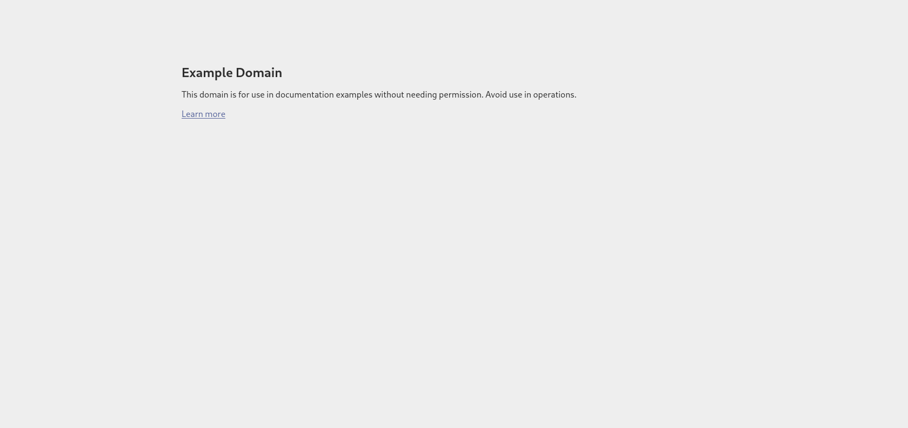

# Arbeitsbericht

- Name: Stefan Raab
- Datum: 10.03.2026
- Thema: cURL
- Fach: SYTB
- Klasse: 3AHITS

# Theorie
## cURL
`cURL` ist ein Kommandozeilentool, welches eine http-request an einen Server schickt und die http-response anzeigt.

Die Syntax ist folgende:
```bash
$ curl options "url"
```

## HTTP
Eine HTTP-Request ist die Anfrage an den Webserver wenn eine URL aufgerufen wird.

Eine URL ist folgendermaßen aufgebaut:

# Aufgaben

### Aufgabe 1
- Rufe die Startseite von example.com mit curl ab. Du siehst den HTML Code der Seite im Terminal. Vergleiche dazu die Ansicht im Web-Browser.

Ausgabe curl:
```bash
┌──(kali㉿kali)-[~/SYTB/Berichte/3AHITS-SYTB-Raab-Stefan]
└─$ curl example.com
<!doctype html><html lang="en"><head><title>Example Domain</title><meta name="viewport" content="width=device-width, initial-scale=1"><style>body{background:#eee;width:60vw;margin:15vh auto;font-family:system-ui,sans-serif}h1{font-size:1.5em}div{opacity:0.8}a:link,a:visited{color:#348}</style></head><body><div><h1>Example Domain</h1><p>This domain is for use in documentation examples without needing permission. Avoid use in operations.</p><p><a href="https://iana.org/domains/example">Learn more</a></p></div></body></html>
```

Im Browser sieht die Seite so aus:


Im Code findet man auch alles wieder was man sieht. Überschrift, Text als auch den Link.

---
### Aufgabe 2

- Rufe dieselbe Seite wie in Aufgabe 1 auf, aber gib zusätzlich den HTTP-Response-Header aus. Hinweis: Es gibt dafür eine eigene curl-Option.

    - Du siehst dann sogenannte Meta-Informationen, das sind Informationen über die Web-Site (z.B.date, content-type) und den Server – die  aber vom Browser nicht angezeigt werden.


Hierfür gibt es mehrere Varianten:
```bash
$ curl -I example.com
```
Mit der Option `-I` wird nur der Header der http-Response angezeigt

```bash
$ curl -i example.com
```
Mit der Option `-i` wiederum wird der Header gemeinsam mit dem Body ausgegeben.

Ich habe `-I` verwendet:
```bash
┌──(kali㉿kali)-[~/SYTB/Berichte/3AHITS-SYTB-Raab-Stefan]
└─$ curl -I example.com
HTTP/1.1 200 OK
Date: Tue, 10 Mar 2026 07:18:29 GMT
Content-Type: text/html
Connection: keep-alive
CF-RAY: 9da08bb01af85bb9-VIE
Last-Modified: Thu, 05 Mar 2026 11:54:13 GMT
Allow: GET, HEAD
Accept-Ranges: bytes
Age: 2486
cf-cache-status: HIT
Server: cloudflare
```
Wie in der Aufgabenstellung beschrieben können wir jetzt einige Meta-Daten der Seite einsehen.

---
### Aufgabe 3

- Verbose Mode. Rufe eine beliebige URL auf und aktiviere den Verbose Mode, sodass Request, Response und Header sichtbar sind.

Um den Verbose Mode zu aktivieren muss man die Option `-v` verwenden:

```bash
┌──(kali㉿kali)-[~/SYTB/Berichte/3AHITS-SYTB-Raab-Stefan]
└─$ curl -v example.com
* Host example.com:80 was resolved.
* IPv6: 2606:4700::6812:1a78, 2606:4700::6812:1b78
* IPv4: 104.18.27.120, 104.18.26.120
*   Trying [2606:4700::6812:1a78]:80...
* Immediate connect fail for 2606:4700::6812:1a78: Network is unreachable
*   Trying [2606:4700::6812:1b78]:80...
* Immediate connect fail for 2606:4700::6812:1b78: Network is unreachable
*   Trying 104.18.27.120:80...
* Connected to example.com (104.18.27.120) port 80
* using HTTP/1.x
> GET / HTTP/1.1
> Host: example.com
> User-Agent: curl/8.13.0
> Accept: */*
> 
* Request completely sent off
< HTTP/1.1 200 OK
< Date: Tue, 10 Mar 2026 07:25:19 GMT
< Content-Type: text/html
< Transfer-Encoding: chunked
< Connection: keep-alive
< CF-RAY: 9da095b3de97c316-VIE
< Last-Modified: Thu, 05 Mar 2026 11:54:13 GMT
< Allow: GET, HEAD
< Accept-Ranges: bytes
< Age: 2896
< cf-cache-status: HIT
< Server: cloudflare
< 
<!doctype html><html lang="en"><head><title>Example Domain</title><meta name="viewport" content="width=device-width, initial-scale=1"><style>body{background:#eee;width:60vw;margin:15vh auto;font-family:system-ui,sans-serif}h1{font-size:1.5em}div{opacity:0.8}a:link,a:visited{color:#348}</style></head><body><div><h1>Example Domain</h1><p>This domain is for use in documentation examples without needing permission. Avoid use in operations.</p><p><a href="https://iana.org/domains/example">Learn more</a></p></div></body></html>
* Connection #0 to host example.com left intact
```

---
### Aufgabe 4

- Rufe diesen Link(https://httpbin.org/status/404) mit curl auf, verwende die Option aus der vorangegangenen Aufgabenstellung. Recherchiere: Was bedeutet dieser http Status Code? Was zeigt ein Web-Browser bei Aufruf dieser URL an?

Aufruf:
```bash
┌──(kali㉿kali)-[~/SYTB/Berichte/3AHITS-SYTB-Raab-Stefan]
└─$ curl -v https://httpbin.org/status/404
* Host httpbin.org:443 was resolved.
* IPv6: (none)
* IPv4: 34.198.18.249, 34.199.144.244, 34.195.100.32, 18.235.222.110, 3.94.136.222, 34.230.126.118
*   Trying 34.198.18.249:443...
* ALPN: curl offers h2,http/1.1
* TLSv1.3 (OUT), TLS handshake, Client hello (1):
*  CAfile: /etc/ssl/certs/ca-certificates.crt
*  CApath: /etc/ssl/certs
* TLSv1.3 (IN), TLS handshake, Server hello (2):
* TLSv1.2 (IN), TLS handshake, Certificate (11):
* TLSv1.2 (IN), TLS handshake, Server key exchange (12):
* TLSv1.2 (IN), TLS handshake, Server finished (14):
* TLSv1.2 (OUT), TLS handshake, Client key exchange (16):
* TLSv1.2 (OUT), TLS change cipher, Change cipher spec (1):
* TLSv1.2 (OUT), TLS handshake, Finished (20):
* TLSv1.2 (IN), TLS handshake, Finished (20):
* SSL connection using TLSv1.2 / ECDHE-RSA-AES128-GCM-SHA256 / secp256r1 / rsaEncryption
* ALPN: server accepted h2
* Server certificate:
*  subject: CN=httpbin.org
*  start date: Jul 20 00:00:00 2025 GMT
*  expire date: Aug 17 23:59:59 2026 GMT
*  subjectAltName: host "httpbin.org" matched cert's "httpbin.org"
*  issuer: C=US; O=Amazon; CN=Amazon RSA 2048 M03
*  SSL certificate verify ok.
*   Certificate level 0: Public key type RSA (2048/112 Bits/secBits), signed using sha256WithRSAEncryption
*   Certificate level 1: Public key type RSA (2048/112 Bits/secBits), signed using sha256WithRSAEncryption
*   Certificate level 2: Public key type RSA (2048/112 Bits/secBits), signed using sha256WithRSAEncryption
* Connected to httpbin.org (34.198.18.249) port 443
* using HTTP/2
* [HTTP/2] [1] OPENED stream for https://httpbin.org/status/404
* [HTTP/2] [1] [:method: GET]
* [HTTP/2] [1] [:scheme: https]
* [HTTP/2] [1] [:authority: httpbin.org]
* [HTTP/2] [1] [:path: /status/404]
* [HTTP/2] [1] [user-agent: curl/8.13.0]
* [HTTP/2] [1] [accept: */*]
> GET /status/404 HTTP/2
> Host: httpbin.org
> User-Agent: curl/8.13.0
> Accept: */*
> 
* Request completely sent off
< HTTP/2 404 
< date: Tue, 10 Mar 2026 07:38:09 GMT
< content-type: text/html; charset=utf-8
< content-length: 0
< server: gunicorn/19.9.0
< access-control-allow-origin: *
< access-control-allow-credentials: true
< 
* Connection #0 to host httpbin.org left intact
```
Der angezeigte http-Status Code ist `404`. Dieser Code bedeutet, dass der Server zwar erreicht wurde, aber die angeforderte Seite oder Datei nicht gefunden wurde.

---
### Aufgabe 5

- Geschlechtsschätzung anhand von Namen. Lade mit curl → du bekommst eine Fehlermeldung. Ein Parameter wird an die URL so angefügt: ?name=value. Ermittle das wahrscheinliche Geschlecht von: Noor, Ariel, Amina, Elowen, Levin. Hinweis: verwende Quotes ("<URL>") in der curl Kommandozeile, da ? in der shell eine spezielle Bedeutung hat.

    - Das Datenformat, das hier vom Server gesendet wird, ist JSON. Ganz viele Web-APIs verwenden JSON. Verwende die Option zum Anzeigen des Response-Headers und suche darin nach einem Hinweis auf dieses Datenformat.

Um diese Aufgabe zu lösen kann man die API von Genderize.io verwenden.

Der curl Befehl würde dann so aussehen:
```bash
$ curl "https://api.genderize.io?name=example"
```

Für die vorgegebenen Namen kommt dann folgendes heraus:

Noor:
```bash
┌──(kali㉿kali)-[~/SYTB/Berichte/3AHITS-SYTB-Raab-Stefan]
└─$ curl "https://api.genderize.io?name=Noor"
{"count":167923,"name":"Noor","gender":"female","probability":0.61} 
```

Ariel:
```bash
┌──(kali㉿kali)-[~/SYTB/Berichte/3AHITS-SYTB-Raab-Stefan]
└─$ curl "https://api.genderize.io?name=Ariel"
{"count":74669,"name":"Ariel","gender":"male","probability":0.83}    
```

Amina:
```bash
┌──(kali㉿kali)-[~/SYTB/Berichte/3AHITS-SYTB-Raab-Stefan]
└─$ curl "https://api.genderize.io?name=Amina"
{"count":198519,"name":"Amina","gender":"female","probability":0.96}   
```

Elowen:
```bash
┌──(kali㉿kali)-[~/SYTB/Berichte/3AHITS-SYTB-Raab-Stefan]
└─$ curl "https://api.genderize.io?name=Elowen"
{"count":23,"name":"Elowen","gender":"female","probability":0.87}    
```

Levin:
```bash
┌──(kali㉿kali)-[~/SYTB/Berichte/3AHITS-SYTB-Raab-Stefan]
└─$ curl "https://api.genderize.io?name=Levin" 
{"count":3186,"name":"Levin","gender":"male","probability":0.96}   
```

Jetzt sehen wir uns noch den Response-Header an:

```bash
┌──(kali㉿kali)-[~/SYTB/Berichte/3AHITS-SYTB-Raab-Stefan]
└─$ curl -I "https://api.genderize.io?name=Levin"
HTTP/2 200 
server: nginx/1.16.1
date: Tue, 10 Mar 2026 07:46:04 GMT
content-type: application/json; charset=utf-8
content-length: 64
vary: accept-encoding
cache-control: max-age=0, private, must-revalidate
x-request-id: GJtrN4ZtHnjVm8qCZavI
access-control-allow-credentials: true
access-control-allow-origin: *
access-control-expose-headers: x-rate-limit-limit,x-rate-limit-remaining,x-rate-limit-reset
x-rate-limit-limit: 100
x-rate-limit-remaining: 78
x-rate-limit-reset: 58436
```

Das zurückgesendete Datenformat findet sich in der Zeile `content-type`: `content-type: application/json; charset=utf-8`

---
### AUfgabe 6

- In einer URL sind auch mehrere Parameter möglich – diese sind mit einem `&` getrennt:
`?para1=value1&para2=value2`.
Aufgabe: Unter dem API Endpoint `https://api.open-meteo.com/v1/forecast` gibt es Wetter Informationen. Die notwendigen Parameter sind `latitude`, `longitude`, und `current_weather` (Wetter-Beispiel). Verwende diese API um die aktuelle Wetterinformation für Braunau und für Funchal abzurufen.

Um diese Aufgabe zu lösen müssen wir uns Breitengrade(latitude) und Längengrade(longitude) für Braunau und Funchal raussuchen. Der `current_weather` Parameter wird auf `true` gesetzt um der API zu sagen, dass wir das aktuelle Wetter wissen wollen.

Braunau:
- Breitengrad: 48.2583
- Längengrad: 13.0333

```bash 
┌──(kali㉿kali)-[~/SYTB/Berichte/3AHITS-SYTB-Raab-Stefan]
└─$ curl "https://api.open-meteo.com/v1/forecast?latitude=48.2583&longitude=13.0333&current_weather=true"
{"latitude":48.260002,"longitude":13.039999,"generationtime_ms":0.10418891906738281,"utc_offset_seconds":0,"timezone":"GMT","timezone_abbreviation":"GMT","elevation":350.0,"current_weather_units":{"time":"iso8601","interval":"seconds","temperature":"°C","windspeed":"km/h","winddirection":"°","is_day":"","weathercode":"wmo code"},"current_weather":{"time":"2026-03-10T08:00","interval":900,"temperature":1.7,"windspeed":0.4,"winddirection":270,"is_day":1,"weathercode":45}}     
```

Funchal:
- Breitengrad: 32.6500
- Längengrad: -16.9167

```bash
┌──(kali㉿kali)-[~/SYTB/Berichte/3AHITS-SYTB-Raab-Stefan]
└─$ curl "https://api.open-meteo.com/v1/forecast?latitude=32.6500&longitude=-16.9167&current_weather=true"
{"latitude":32.6875,"longitude":-16.875,"generationtime_ms":0.09012222290039062,"utc_offset_seconds":0,"timezone":"GMT","timezone_abbreviation":"GMT","elevation":99.0,"current_weather_units":{"time":"iso8601","interval":"seconds","temperature":"°C","windspeed":"km/h","winddirection":"°","is_day":"","weathercode":"wmo code"},"current_weather":{"time":"2026-03-10T08:00","interval":900,"temperature":12.9,"windspeed":13.0,"winddirection":19,"is_day":1,"weathercode":2}}                                                                                                                              
```

---
### Aufgabe 7

- JSON-Ausgaben sind kompakt und daher manchmal sehr schwer zu lesen. Pipe die Ausgabe von curl in das Tool `jq`, um zu formatieren.

Das Tool `jq` ist noch nicht installiert. Wir müssen es als erstes mit `$ sudo apt install jq` installieren. Danach können wir die Ausgaben von vorhin formatieren:

Braunau:
```bash
┌──(kali㉿kali)-[~/SYTB/Berichte/3AHITS-SYTB-Raab-Stefan]
└─$ curl "https://api.open-meteo.com/v1/forecast?latitude=48.2583&longitude=13.0333&current_weather=true" | jq 
  % Total    % Received % Xferd  Average Speed   Time    Time     Time  Current
                                 Dload  Upload   Total   Spent    Left  Speed
100   475    0   475    0     0    337      0 --:--:--  0:00:01 --:--:--   337
{
  "latitude": 48.260002,
  "longitude": 13.039999,
  "generationtime_ms": 11.355042457580566,
  "utc_offset_seconds": 0,
  "timezone": "GMT",
  "timezone_abbreviation": "GMT",
  "elevation": 350.0,
  "current_weather_units": {
    "time": "iso8601",
    "interval": "seconds",
    "temperature": "°C",
    "windspeed": "km/h",
    "winddirection": "°",
    "is_day": "",
    "weathercode": "wmo code"
  },
  "current_weather": {
    "time": "2026-03-10T08:00",
    "interval": 900,
    "temperature": 1.7,
    "windspeed": 0.4,
    "winddirection": 270,
    "is_day": 1,
    "weathercode": 45
  }
}
```

Funchal:
```bash
┌──(kali㉿kali)-[~/SYTB/Berichte/3AHITS-SYTB-Raab-Stefan]
└─$ curl "https://api.open-meteo.com/v1/forecast?latitude=32.6500&longitude=-16.9167&current_weather=true" | jq 
  % Total    % Received % Xferd  Average Speed   Time    Time     Time  Current
                                 Dload  Upload   Total   Spent    Left  Speed
100   471    0   471    0     0   4670      0 --:--:-- --:--:-- --:--:--  4710
{
  "latitude": 32.6875,
  "longitude": -16.875,
  "generationtime_ms": 0.08809566497802734,
  "utc_offset_seconds": 0,
  "timezone": "GMT",
  "timezone_abbreviation": "GMT",
  "elevation": 99.0,
  "current_weather_units": {
    "time": "iso8601",
    "interval": "seconds",
    "temperature": "°C",
    "windspeed": "km/h",
    "winddirection": "°",
    "is_day": "",
    "weathercode": "wmo code"
  },
  "current_weather": {
    "time": "2026-03-10T08:00",
    "interval": 900,
    "temperature": 12.9,
    "windspeed": 13.0,
    "winddirection": 19,
    "is_day": 1,
    "weathercode": 2
  }
}
```

---
### Aufgabe 8

- Um welche Stadt handelt es sich im Wetter-Beispiel? Verwende den API Endpoint https://api-bdc.io/data/reverse-geocode-client um das herauszufinden.

Im Wetter-Beispiel(https://api.open-meteo.com/v1/forecast?latitude=35.6895&longitude=139.6917&current_weather=true) finden wir eine latitude und auch longitude. Diese übergeben wir der API.

```bash
┌──(kali㉿kali)-[~/SYTB/Berichte/3AHITS-SYTB-Raab-Stefan]
└─$ curl "https://api-bdc.io/data/reverse-geocode-client?latitude=35.6895&longitude=139.6917" | jq              
  % Total    % Received % Xferd  Average Speed   Time    Time     Time  Current
                                 Dload  Upload   Total   Spent    Left  Speed
100  2674  100  2674    0     0  22982      0 --:--:-- --:--:-- --:--:-- 23051
{
  "latitude": 35.6895,
  "lookupSource": "coordinates",
  "longitude": 139.6917,
  "localityLanguageRequested": "en",
  "continent": "Asia",
  "continentCode": "AS",
  "countryName": "Japan",
  "countryCode": "JP",
  "principalSubdivision": "Tokyo",
  "principalSubdivisionCode": "JP-13",
  "city": "Tokyo",
  "locality": "Shinjuku",
  "postcode": "",
  "plusCode": "8Q7XMMQR+RM",
  "localityInfo": {
    "administrative": [
      {
        "name": "Japan",
        "description": "island country in East Asia",
        "isoName": "Japan",
        "order": 3,
        "adminLevel": 2,
        "isoCode": "JP",
        "wikidataId": "Q17",
        "geonameId": 1861060
      },
      {
        "name": "Kanto region",
        "description": "one of 8 regions in Japan encompassing 8 prefectures",
        "order": 5,
        "adminLevel": 3,
        "wikidataId": "Q132480"
      },
      {
        "name": "Tokaido",
        "description": "Japanese geographical term",
        "order": 6,
        "adminLevel": 3,
        "wikidataId": "Q1196306"
      },
      {
        "name": "Tokyo",
        "description": "capital and largest city of Japan",
        "order": 7,
        "adminLevel": 4,
        "wikidataId": "Q1490",┌──(kali㉿kali)-[~/SYTB/Berichte/3AHITS-SYTB-Raab-Stefan]
└─$ curl "https://api-bdc.io/data/reverse-geocode-client?latitude=35.6895&longitude=139.6917" | jq              
  % Total    % Received % Xferd  Average Speed   Time    Time     Time  Current
                                 Dload  Upload   Total   Spent    Left  Speed
100  2674  100  2674    0     0  22982      0 --:--:-- --:--:-- --:--:-- 23051
{
  "latitude": 35.6895,
  "lookupSource": "coordinates",
  "longitude": 139.6917,
  "localityLanguageRequested": "en",
  "continent": "Asia",
  "continentCode": "AS",
  "countryName": "Japan",
  "countryCode": "JP",
  "principalSubdivision": "Tokyo",
  "principalSubdivisionCode": "JP-13",
  "city": "Tokyo",
  "locality": "Shinjuku",
  "postcode": "",
  "plusCode": "8Q7XMMQR+RM",
  "localityInfo": {
    "administrative": [
      {
        "name": "Japan",
        "description": "island country in East Asia",
        "isoName": "Japan",
        "order": 3,
        "adminLevel": 2,
        "isoCode": "JP",
        "wikidataId": "Q17",
        "geonameId": 1861060
      },
      {
        "name": "Kanto region",
        "description": "one of 8 regions in Japan encompassing 8 prefectures",
        "order": 5,
        "adminLevel": 3,
        "wikidataId": "Q132480"
      },
      {
        "name": "Tokaido",
        "description": "Japanese geographical term",
        "order": 6,
        "adminLevel": 3,
        "wikidataId": "Q1196306"
      },
      {
        "name": "Tokyo",
        "description": "capital and largest city of Japan",
        "order": 7,
        "adminLevel": 4,
        "wikidataId": "Q1490",
        "geonameId": 1850147
      },
      {
        "name": "Tokyo",
        "description": "capital and largest city of Japan",
        "isoName": "Tokyo",
        "order": 8,
        "adminLevel": 4,
        "isoCode": "JP-13",
        "wikidataId": "Q1490",
        "geonameId": 1850144
      },
      {
        "name": "Musashi Province",
        "description": "former province of Japan",
        "order": 9,
        "adminLevel": 4,
        "wikidataId": "Q907398"
      },
      {
        "name": "Shinjuku",
        "description": "special ward in the Tokyo Metropolis, Japan",
        "order": 11,
        "adminLevel": 7,
        "wikidataId": "Q179645",
        "geonameId": 11790353
      }
    ],
    "informative": [
      {
        "name": "Asia",
        "description": "terrestrial continent, mainly in the northeastern quadrant",
        "isoName": "Asia",
        "order": 1,
        "isoCode": "AS",
        "wikidataId": "Q48",
        "geonameId": 6255147
      },
      {
        "name": "Asia/Tokyo",
        "description": "time zone",
        "order": 2
      },
      {
        "name": "Honshu",
        "description": "largest island of Japan",
        "order": 4,┌──(kali㉿kali)-[~/SYTB/Berichte/3AHITS-SYTB-Raab-Stefan]
└─$ curl "https://api-bdc.io/data/reverse-geocode-client?latitude=35.6895&longitude=139.6917" | jq              
  % Total    % Received % Xferd  Average Speed   Time    Time     Time  Current
                                 Dload  Upload   Total   Spent    Left  Speed
100  2674  100  2674    0     0  22982      0 --:--:-- --:--:-- --:--:-- 23051
{
  "latitude": 35.6895,
  "lookupSource": "coordinates",
  "longitude": 139.6917,
  "localityLanguageRequested": "en",
  "continent": "Asia",
  "continentCode": "AS",
  "countryName": "Japan",
  "countryCode": "JP",
  "principalSubdivision": "Tokyo",
  "principalSubdivisionCode": "JP-13",
  "city": "Tokyo",
  "locality": "Shinjuku",
  "postcode": "",
  "plusCode": "8Q7XMMQR+RM",
  "localityInfo": {
    "administrative": [
      {
        "name": "Japan",
        "description": "island country in East Asia",
        "isoName": "Japan",
        "order": 3,
        "adminLevel": 2,
        "isoCode": "JP",
        "wikidataId": "Q17",
        "geonameId": 1861060
      },
      {
        "name": "Kanto region",
        "description": "one of 8 regions in Japan encompassing 8 prefectures",
        "order": 5,
        "adminLevel": 3,
        "wikidataId": "Q132480"
      },
      {
        "name": "Tokaido",
        "description": "Japanese geographical term",
        "order": 6,
        "adminLevel": 3,
        "wikidataId": "Q1196306"
      },
      {
        "name": "Tokyo",
        "description": "capital and largest city of Japan",
        "order": 7,
        "adminLevel": 4,
        "wikidataId": "Q1490",
        "geonameId": 1850147
      },
      {
        "name": "Tokyo",
        "description": "capital and largest city of Japan",
        "isoName": "Tokyo",
        "order": 8,
        "adminLevel": 4,
        "isoCode": "JP-13",
        "wikidataId": "Q1490",
        "geonameId": 1850144
      },
      {
        "name": "Musashi Province",
        "description": "former province of Japan",
        "order": 9,
        "adminLevel": 4,
        "wikidataId": "Q907398"
      },
      {
        "name": "Shinjuku",
        "description": "special ward in the Tokyo Metropolis, Japan",
        "order": 11,
        "adminLevel": 7,
        "wikidataId": "Q179645",
        "geonameId": 11790353
      }
    ],
    "informative": [
      {
        "name": "Asia",
        "description": "terrestrial continent, mainly in the northeastern quadrant",
        "isoName": "Asia",
        "order": 1,
        "isoCode": "AS",
        "wikidataId": "Q48",
        "geonameId": 6255147
      },
      {
        "name": "Asia/Tokyo",
        "description": "time zone",
        "order": 2┌──(kali㉿kali)-[~/SYTB/Berichte/3AHITS-SYTB-Raab-Stefan]
└─$ curl "https://api-bdc.io/data/reverse-geocode-client?latitude=35.6895&longitude=139.6917" | jq              
  % Total    % Received % Xferd  Average Speed   Time    Time     Time  Current
                                 Dload  Upload   Total   Spent    Left  Speed
100  2674  100  2674    0     0  22982      0 --:--:-- --:--:-- --:--:-- 23051
{
  "latitude": 35.6895,
  "lookupSource": "coordinates",
  "longitude": 139.6917,
  "localityLanguageRequested": "en",
  "continent": "Asia",
  "continentCode": "AS",
  "countryName": "Japan",
  "countryCode": "JP",
  "principalSubdivision": "Tokyo",
  "principalSubdivisionCode": "JP-13",
  "city": "Tokyo",
  "locality": "Shinjuku",
  "postcode": "",
  "plusCode": "8Q7XMMQR+RM",
  "localityInfo": {
    "administrative": [
      {
        "name": "Japan",
        "description": "island country in East Asia",
        "isoName": "Japan",
        "order": 3,
        "adminLevel": 2,
        "isoCode": "JP",
        "wikidataId": "Q17",
        "geonameId": 1861060
      },
      {
        "name": "Kanto region",
        "description": "one of 8 regions in Japan encompassing 8 prefectures",
        "order": 5,
        "adminLevel": 3,
        "wikidataId": "Q132480"
      },
      {
        "name": "Tokaido",
        "description": "Japanese geographical term",
        "order": 6,
        "adminLevel": 3,
        "wikidataId": "Q1196306"
      },
      {
        "name": "Tokyo",
        "description": "capital and largest city of Japan",
        "order": 7,
        "adminLevel": 4,
        "wikidataId": "Q1490",
        "geonameId": 1850147
      },
      {
        "name": "Tokyo",
        "description": "capital and largest city of Japan",
        "isoName": "Tokyo",
        "order": 8,
        "adminLevel": 4,
        "isoCode": "JP-13",
        "wikidataId": "Q1490",
        "geonameId": 1850144
      },
      {
        "name": "Musashi Province",
        "description": "former province of Japan",
        "order": 9,
        "adminLevel": 4,
        "wikidataId": "Q907398"
      },
      {
        "name": "Shinjuku",
        "description": "special ward in the Tokyo Metropolis, Japan",
        "order": 11,
        "adminLevel": 7,
        "wikidataId": "Q179645",
        "geonameId": 11790353
      }
    ],
    "informative": [
      {
        "name": "Asia",
        "description": "terrestrial continent, mainly in the northeastern quadrant",
        "isoName": "Asia",
        "order": 1,
        "isoCode": "AS",
        "wikidataId": "Q48",
        "geonameId": 6255147
      },
      {
        "name": "Asia/Tokyo",
        "description": "time zone",
        "order": 2┌──(kali㉿kali)-[~/SYTB/Berichte/3AHITS-SYTB-Raab-Stefan]
└─$ curl "https://api-bdc.io/data/reverse-geocode-client?latitude=35.6895&longitude=139.6917" | jq              
  % Total    % Received % Xferd  Average Speed   Time    Time     Time  Current
                                 Dload  Upload   Total   Spent    Left  Speed
100  2674  100  2674    0     0  22982      0 --:--:-- --:--:-- --:--:-- 23051
{
  "latitude": 35.6895,
  "lookupSource": "coordinates",
  "longitude": 139.6917,
  "localityLanguageRequested": "en",
  "continent": "Asia",
  "continentCode": "AS",
  "countryName": "Japan",
  "countryCode": "JP",
  "principalSubdivision": "Tokyo",
  "principalSubdivisionCode": "JP-13",
  "city": "Tokyo",
  "locality": "Shinjuku",
  "postcode": "",
  "plusCode": "8Q7XMMQR+RM",
  "localityInfo": {
    "administrative": [
      {
        "name": "Japan",
        "description": "island country in East Asia",
        "isoName": "Japan",
        "order": 3,
        "adminLevel": 2,
        "isoCode": "JP",
        "wikidataId": "Q17",
        "geonameId": 1861060
      },
      {
        "name": "Kanto region",
        "description": "one of 8 regions in Japan encompassing 8 prefectures",
        "order": 5,
        "adminLevel": 3,
        "wikidataId": "Q132480"
      },
      {
        "name": "Tokaido",
        "description": "Japanese geographical term",
        "order": 6,
        "adminLevel": 3,
        "wikidataId": "Q1196306"
      },
      {
        "name": "Tokyo",
        "description": "capital and largest city of Japan",
        "order": 7,
        "adminLevel": 4,
        "wikidataId": "Q1490",
        "geonameId": 1850147
      },
      {
        "name": "Tokyo",
        "description": "capital and largest city of Japan",
        "isoName": "Tokyo",
        "order": 8,
        "adminLevel": 4,
        "isoCode": "JP-13",
        "wikidataId": "Q1490",
        "geonameId": 1850144
      },
      {
        "name": "Musashi Province",
        "description": "former province of Japan",
        "order": 9,
        "adminLevel": 4,
        "wikidataId": "Q907398"
      },
      {
        "name": "Shinjuku",
        "description": "special ward in the Tokyo Metropolis, Japan",
        "order": 11,
        "adminLevel": 7,
        "wikidataId": "Q179645",
        "geonameId": 11790353
      }
    ],
    "informative": [
      {
        "name": "Asia",
        "description": "terrestrial continent, mainly in the northeastern quadrant",
        "isoName": "Asia",
        "order": 1,
        "isoCode": "AS",
        "wikidataId": "Q48",
        "geonameId": 6255147
      },
      {
        "name": "Asia/Tokyo",
        "description": "time zone",
        "order": 2┌──(kali㉿kali)-[~/SYTB/Berichte/3AHITS-SYTB-Raab-Stefan]
└─$ curl "https://api-bdc.io/data/reverse-geocode-client?latitude=35.6895&longitude=139.6917" | jq              
  % Total    % Received % Xferd  Average Speed   Time    Time     Time  Current
                                 Dload  Upload   Total   Spent    Left  Speed
100  2674  100  2674    0     0  22982      0 --:--:-- --:--:-- --:--:-- 23051
{
  "latitude": 35.6895,
  "lookupSource": "coordinates",
  "longitude": 139.6917,
  "localityLanguageRequested": "en",
  "continent": "Asia",
  "continentCode": "AS",
  "countryName": "Japan",
  "countryCode": "JP",
  "principalSubdivision": "Tokyo",
  "principalSubdivisionCode": "JP-13",
  "city": "Tokyo",
  "locality": "Shinjuku",
  "postcode": "",
  "plusCode": "8Q7XMMQR+RM",
  "localityInfo": {
    "administrative": [
      {
        "name": "Japan",
        "description": "island country in East Asia",
        "isoName": "Japan",
        "order": 3,
        "adminLevel": 2,
        "isoCode": "JP",
        "wikidataId": "Q17",
        "geonameId": 1861060
      },
      {
        "name": "Kanto region",
        "description": "one of 8 regions in Japan encompassing 8 prefectures",
        "order": 5,
        "adminLevel": 3,
        "wikidataId": "Q132480"
      },
      {
        "name": "Tokaido",
        "description": "Japanese geographical term",
        "order": 6,
        "adminLevel": 3,
        "wikidataId": "Q1196306"
      },
      {
        "name": "Tokyo",
        "description": "capital and largest city of Japan",
        "order": 7,
        "adminLevel": 4,
        "wikidataId": "Q1490",
        "geonameId": 1850147
      },
      {
        "name": "Tokyo",
        "description": "capital and largest city of Japan",
        "isoName": "Tokyo",
        "order": 8,
        "adminLevel": 4,
        "isoCode": "JP-13",
        "wikidataId": "Q1490",
        "geonameId": 1850144
      },
      {
        "name": "Musashi Province",
        "description": "former province of Japan",
        "order": 9,
        "adminLevel": 4,
        "wikidataId": "Q907398"
      },
      {
        "name": "Shinjuku",
        "description": "special ward in the Tokyo Metropolis, Japan",
        "order": 11,
        "adminLevel": 7,
        "wikidataId": "Q179645",
        "geonameId": 11790353
      }
    ],
    "informative": [
      {
        "name": "Asia",
        "description": "terrestrial continent, mainly in the northeastern quadrant",
        "isoName": "Asia",
        "order": 1,
        "isoCode": "AS",
        "wikidataId": "Q48",
        "geonameId": 6255147
      },
      {
        "name": "Asia/Tokyo",
        "description": "time zone",
        "order": 2
      },
      {
        "name": "Honshu",
        "description": "largest island of Japan",
        "order": 4,
        "wikidataId": "Q13989",
        "geonameId": 1862185
      },
      {
        "name": "special ward of Japan",
        "description": "administrative division of Japan",
        "order": 10,
        "wikidataId": "Q5327704"
      }
    ]
  }
}
      },
      {
        "name": "Honshu",
        "description": "largest island of Japan",
        "order": 4,
        "wikidataId": "Q13989",
        "geonameId": 1862185
      },
      {
        "name": "special ward of Japan",
        "description": "administrative division of Japan",
        "order": 10,
        "wikidataId": "Q5327704"
      }
    ]
  }
}
      },
      {
        "name": "Honshu",
        "description": "largest island of Japan",
        "order": 4,
        "wikidataId": "Q13989",
        "geonameId": 1862185
      },
      {
        "name": "special ward of Japan",
        "description": "administrative division of Japan",
        "order": 10,
        "wikidataId": "Q5327704"
      }
    ]
  }
}
      },
      {
        "name": "Honshu",
        "description": "largest island of Japan",
        "order": 4,
        "wikidataId": "Q13989",
        "geonameId": 1862185
      },
      {
        "name": "special ward of Japan",
        "description": "administrative division of Japan",
        "order": 10,
        "wikidataId": "Q5327704"
      }
    ]
  }
}
        "wikidataId": "Q13989",
        "geonameId": 1862185
      },
      {
        "name": "special ward of Japan",
        "description": "administrative division of Japan",
        "order": 10,
        "wikidataId": "Q5327704"
      }
    ]
  }
}
        "geonameId": 1850147
      }┌──(kali㉿kali)-[~/SYTB/Berichte/3AHITS-SYTB-Raab-Stefan]
└─$ curl "https://api-bdc.io/data/reverse-geocode-client?latitude=35.6895&longitude=139.6917" | jq              
  % Total    % Received % Xferd  Average Speed   Time    Time     Time  Current
                                 Dload  Upload   Total   Spent    Left  Speed
100  2674  100  2674    0     0  22982      0 --:--:-- --:--:-- --:--:-- 23051
{
  "latitude": 35.6895,
  "lookupSource": "coordinates",
  "longitude": 139.6917,
  "localityLanguageRequested": "en",
  "continent": "Asia",
  "continentCode": "AS",
  "countryName": "Japan",
  "countryCode": "JP",
  "principalSubdivision": "Tokyo",
  "principalSubdivisionCode": "JP-13",
  "city": "Tokyo",
  "locality": "Shinjuku",
  "postcode": "",
  "plusCode": "8Q7XMMQR+RM",
  "localityInfo": {
    "administrative": [
      {
        "name": "Japan",
        "description": "island country in East Asia",
        "isoName": "Japan",
        "order": 3,
        "adminLevel": 2,
        "isoCode": "JP",
        "wikidataId": "Q17",
        "geonameId": 1861060
      },
      {
        "name": "Kanto region",
        "description": "one of 8 regions in Japan encompassing 8 prefectures",
        "order": 5,
        "adminLevel": 3,
        "wikidataId": "Q132480"
      },
      {
        "name": "Tokaido",
        "description": "Japanese geographical term",
        "order": 6,
        "adminLevel": 3,
        "wikidataId": "Q1196306"
      },
      {
        "name": "Tokyo",
        "description": "capital and largest city of Japan",
        "order": 7,
        "adminLevel": 4,
        "wikidataId": "Q1490",
        "geonameId": 1850147
      },
      {
        "name": "Tokyo",
        "description": "capital and largest city of Japan",
        "isoName": "Tokyo",
        "order": 8,
        "adminLevel": 4,
        "isoCode": "JP-13",
        "wikidataId": "Q1490",
        "geonameId": 1850144
      },
      {
        "name": "Musashi Province",
        "description": "former province of Japan",
        "order": 9,
        "adminLevel": 4,
        "wikidataId": "Q907398"
      },
      {
        "name": "Shinjuku",
        "description": "special ward in the Tokyo Metropolis, Japan",
        "order": 11,
        "adminLevel": 7,
        "wikidataId": "Q179645",
        "geonameId": 11790353
      }
    ],
    "informative": [
      {
        "name": "Asia",
        "description": "terrestrial continent, mainly in the northeastern quadrant",
        "isoName": "Asia",
        "order": 1,
        "isoCode": "AS",
        "wikidataId": "Q48",
        "geonameId": 6255147
      },
      {
        "name": "Asia/Tokyo",
        "description": "time zone",
        "order": 2
      },
      {
        "name": "Honshu",
        "description": "largest island of Japan",
        "order": 4,
        "wikidataId": "Q13989",
        "geonameId": 1862185
      },
      {
        "name": "special ward of Japan",
        "description": "administrative division of Japan",
        "order": 10,
        "wikidataId": "Q5327704"
      }
    ]
  }
},
      {
        "name": "Tokyo",
        "description": "capital and largest city of Japan",
        "isoName": "Tokyo",
        "order": 8,
        "adminLevel": 4,
        "isoCode": "JP-13",
        "wikidataId": "Q1490",
        "geonameId": 1850144
      },
      {
        "name": "Musashi Province",
        "description": "former province of Japan",
        "order": 9,
        "adminLevel": 4,
        "wikidataId": "Q907398"
      },
      {
        "name": "Shinjuku",
        "description": "special ward in the Tokyo Metropolis, Japan",
        "order": 11,
        "adminLevel": 7,
        "wikidataId": "Q179645",
        "geonameId": 11790353
      }
    ],
    "informative": [
      {
        "name": "Asia",
        "description": "terrestrial continent, mainly in the northeastern quadrant",
        "isoName": "Asia",
        "order": 1,
        "isoCode": "AS",
        "wikidataId": "Q48",
        "geonameId": 6255147
      },
      {
        "name": "Asia/Tokyo",
        "description": "time zone",
        "order": 2
      },
      {
        "name": "Honshu",
        "description": "largest island of Japan",
        "order": 4,
        "wikidataId": "Q13989",
        "geonameId": 1862185
      },
      {
        "name": "special ward of Japan",
        "description": "administrative division of Japan",
        "order": 10,
        "wikidataId": "Q5327704"
      }
    ]
  }
}
```

Die Stadt des Wetter-Beispiels ist Tokyo!