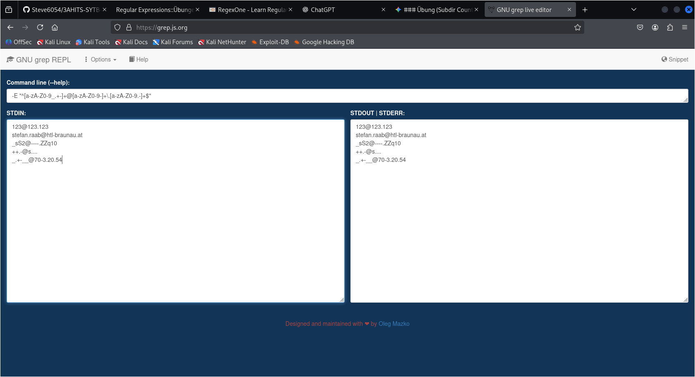

# Arbeitsbericht

- Name: Stefan Raab
- Datum: 26.05.2026
- Thema: Regular expressions
- Fach: SYTB
- Klasse: 3AHITS

---

## Theorie

regular expressions können bei verschiedensten Kommandos angewendet werden.

### grep

Grundfunktion von `grep` ist es einen String in einer Datei zu suchen.
Bsp.:
```sh
┌──(kali㉿kali)-[~/260526]
└─$ grep 'Werkstatt' klassenkassa.csv
Sophia,22.09.2023,15.0,Werkstatt
Lena,18.09.2023,13.0,Werkstatt
Emma,22.09.2023,42.0,Werkstatt
Nico,18.09.2023,23.0,Werkstatt
...
```

Mit regular expressions kann man statt einem festen String, der 1 zu 1 so vorkommen muss um gezählt zu werden, aber auch nach bestimmten Mustern suchen.
Bsp.:
```sh
┌──(kali㉿kali)-[~/260526]
└─$ grep 'W.*' klassenkassa.csv      
Sophia,22.09.2023,15.0,Werkstatt
Janina,02.10.2023,10.0,Walter
Anna,15.10.2024,8.73,Walter
Laura,28.10.2024,3.21,Werkstatt
Jan,30.11.2024,2.56,Walter
...
```

In diesem Beispiel wird nach einem String gesucht der erst ein `W` enthält und dann beliebige Zeichen. Der `.` steht für ein einzelnes beliebiges Textzeichen. Durch `*` wird dann noch angegeben, dass diese beliebigen Zeichen auch beliebig oft vorkommen können.

Es kann auch nach einer Gruppe von Zeichen gesucht werden. Bsp.:
```sh
┌──(kali㉿kali)-[~/260526]
└─$ grep '1[0-9]\.' klassenkassa.csv 
Sophia,22.09.2023,15.0,Werkstatt
lena,24.11.2023,1.0,Bus
Sophia,20.11.2023,2.0,Kino
Felix,11.11.2023,10.5,Walter
...
```

In diesem Beispiel wird nach einem String gesucht der mit `1` beginnt, dann eine beliebige Zahl `[0-9]` und dann einen Punkt `\.` enthält. Da der Punkt normalerweise für ein beliebiges Textzeichen steht muss dieser vorher maskiert werden, daher `\`.

`grep` bietet einem auch die Möglichkeit nur den gematchten String auszugeben, Option `-o`:
```sh
┌──(kali㉿kali)-[~/260526]
└─$ grep -o '1[0-9]\.' klassenkassa.csv
15.
18.
13.
15.
...
```

Möchte man nach dem Datum suchen und nicht die Beträge dabei haben, könnte man den Befehl folgend erweitern:
```sh
┌──(kali㉿kali)-[~/260526]
└─$ grep  '1[0-9]\.[0-9][0-9]\.' klassenkassa.csv 
Lena,18.09.2023,13.0,Werkstatt
Lukas,15.09.2023,2.5,Kino
Nico,18.09.2023,23.0,Werkstatt
Felix,14.10.2023,21.4,Kino
...
```

### sed

Das `sed` Kommando kann verwendet werden um bestimmte Teile/Strings zu ersetzen. Bsp.:

```sh
┌──(kali㉿kali)-[~/260526]
└─$ echo '1234ccbbaa1234' | sed 's/ccbbaa/XYZ/'  
1234XYZ1234
```

Dabei gilt: `sed 's/zu ersetzender String/Ersatz für diesen String/'`

Auch hier kann man mithilfe von regular expressions nach bestimmten Mustern suchen.

```sh
┌──(kali㉿kali)-[~/260526]
└─$ echo '1234cc1!aa1234' | sed 's/cc..aa/XYZ/'
1234XYZ1234
```

Auch nach bestimmten Gruppen an Textzeichen kann gesucht werden:

```sh
┌──(kali㉿kali)-[~/260526]
└─$ echo 'kfjla' | sed 's/[ab]/XYZ/'
kfjlXYZ
                                                                             
┌──(kali㉿kali)-[~/260526]
└─$ echo 'afjla' | sed 's/[ab]/XYZ/'      
XYZfjla
```

Hinweis: sucht man bei `sed` so nach einem Muster, wird nur das erste Match auch wirklich ersetzt. Alle weiteren Vorkommen werden ignoriert.

Man kann den zu ersetzenden Text auch wiederverwenden -> `&`
```sh
┌──(kali㉿kali)-[~/260526]
└─$ echo 'Version V12.51 / March 2026' | sed 's/V[0-9]*\.[0-9]*/(&)/'  
Version (V12.51) / March 2026
```

Schreibt man `^` innerhalb einer Gruppe, dann wird diese Gruppe NICHT betroffen.
```sh
┌──(kali㉿kali)-[~/260526]
└─$ echo 'hgkjfhAkdj' | sed 's/[^a-z]/_/'                            
hgkjfh_kdj
```

#### line anchor

Mit `line anchor` kann man auch noch festlegen wo im Text der String vorkommen soll:
- `^` -> Anfang der Zeile
- `$` -> Ende der Zeile

Beispiele:
```sh
┌──(kali㉿kali)-[~/260526]
└─$ echo 'kjfhdsk' | sed 's/^k/_/'
_jfhdsk
                                                                             
┌──(kali㉿kali)-[~/260526]
└─$ echo 'kjfhdsk' | sed 's/^j/_/'
kjfhdsk
                                                                             
┌──(kali㉿kali)-[~/260526]
└─$ echo 'kjfhdskjj' | sed 's/j$/_/'
kjfhdskj_
                                                                             
┌──(kali㉿kali)-[~/260526]
└─$ echo 'kjfhdskjj' | sed 's/jj$/_/'
kjfhdsk_
```

### Extended Regular Expressions

Kann man bei Kommandos mit der Option `-E` aktivieren

- `..+` --> sucht nach String, der mindestens 1 bis beliebig oft auftritt
- `..?` --> sucht nach String, der beliebig oft vorkommt (auch 0 mal)
- `(Test)` --> Sucht nach dem ganzen Wort `Test` statt nach den Textzeichen `T`, `e`, `s` und `t`
- `..{5}` --> Sucht nach einer angegebenen Anzahl des Strings (Bsp.: 5-mal)
- `\1 \2 \3` --> Liefert das gefundene (Backreferenz)

## Übungen

### RegexOne


### Übung (Subdir Count)

Schreibe einen shell Einzeiler mit dem man die Anzahl der Unterverzeichnisse im aktuellen Verzeichnisse zählt.

Tipp: Directories haben in der `ls -l` Ausgabe ganz am Beginn ein `d`.

Lösung:
```bash
┌──(kali㉿kali)-[~]
└─$ ls -l | grep -c "^d"
20
```

Die Option `-c` zählt die Treffer, anstatt sie auszugeben.

### Übung (REs)

Finde 5 substantiell unterschiedliche Strings die durch folgende RE gematcht werden:

`^[a-zA-Z0-9_.+-]+@[a-zA-Z0-9-]+\.[a-zA-Z0-9.-]+$`

Verwende zum test `grep.js.org`

Achtung: ERE daher `-E` Option notwendig.

Lösung:


### Übung (sed)

Löse mit sed:

   - Entferne alle `#` die sich am Ende der Zeile befinden
   - Entferne alle `#` die sich am Anfang der Zeile befinden
   - Füge `===` am Beginn jeder Zeile ein
   - Füge `()` rund um jedes Wort ein. Ein Wort ist definiert als mindestens ein nicht-Leerzeichen.

Entfernen von `#` am Anfang:
```bash
┌──(kali㉿kali)-[~]
└─$ echo "##TestText Wort####" | sed 's/^#*//' 
TestText Wort####
```

Entfernen von `#` am Ende:
```bash
┌──(kali㉿kali)-[~]
└─$ echo "##TestText Wort####" | sed -E 's/#*$//'
##TestText Wort
```

Anfügen von `===` am Anfang der Zeile:
```bash
┌──(kali㉿kali)-[~]
└─$ echo "##TestText Wort####" | sed -E 's/^/===/'
===##TestText Wort####
```

Einfügen von `()` rund um Wörter (Leider keine Lösung ohne KI gefunden.):
```bash
┌──(kali㉿kali)-[~]
└─$ echo "##TestText Wort####" | sed -E 's/([^[:space:]]+)/(\1)/g'          
(##TestText) (Wort####)
```

### Übung (Datum)

Mit sed. Datum re-formatieren von `YYYY-MM-TT` auf `TT.MM.YYYY`. `01/12/2020`-> `12.01.2020`. Das Datum kann sich an beliebiger Position in der Zeile befinden.

Lösung:
```bash
┌──(kali㉿kali)-[~]
└─$ echo "2026-06-02" | sed -E 's/([0-9]{4})-([0-9]{2})-([0-9]{2})/\3.\2.\1/'
02.06.2026

┌──(kali㉿kali)-[~]
└─$ echo "Heute ist 2026-06-02" | sed -E 's/([0-9]{4})-([0-9]{2})-([0-9]{2})/\3.\2.\1/'
Heute ist 02.06.2026
```

### Übung (Logfile)

Lege eine Textdatei mit folgendem Inhalt an (Ausschnitt aus einem Logfile).

Aufgabenstellung:

- Verwende grep um nur jene Zeilen auszugeben die `configure` enthalten. Jene Zeilen die `half-configured` enthalten sollen nicht ausgegeben werden.
- Verwende grep um nur jene Zeilen auszugeben die `libsombok` oder `libposix` enthalten.
- Verwende sed um die Zeilen ohne die Uhrzeit auszugeben, d.h. ersetzte durch einen leeren String.
- Verwende sed um die Zeilen ohne das Datum auszugeben.
- Verwende sed um das Datum umzuformatieren von `YYYY-MM-TT` auf `TT.MM.YYYY`. `2021-01-16`-> `16.01.2021`.

```
2021-01-16 23:38:01 status unpacked libarchive-zip-perl:all 1.60-1ubuntu0.1
2021-01-16 23:38:01 status half-configured libarchive-zip-perl:all 1.60-1ubuntu0.1
2021-01-16 23:38:01 status installed libarchive-zip-perl:all 1.60-1ubuntu0.1
2021-01-16 23:38:01 configure libmime-charset-perl:all 1.012.2-1 <none>
2021-01-16 23:38:01 status unpacked libmime-charset-perl:all 1.012.2-1
2021-01-16 23:38:01 status half-configured libmime-charset-perl:all 1.012.2-1
2021-01-16 23:38:01 status installed libmime-charset-perl:all 1.012.2-1
2021-01-16 23:38:01 configure libimage-exiftool-perl:all 10.80-1 <none>
2021-01-16 23:38:01 status unpacked libimage-exiftool-perl:all 10.80-1
2021-01-16 23:38:01 status half-configured libimage-exiftool-perl:all 10.80-1
2021-01-16 23:38:01 status installed libimage-exiftool-perl:all 10.80-1
2021-01-16 23:38:01 trigproc man-db:amd64 2.8.3-2 <none>
2021-01-16 23:38:01 status half-configured man-db:amd64 2.8.3-2
2021-01-16 23:38:21 status installed man-db:amd64 2.8.3-2
2021-01-16 23:38:21 configure libsombok3:amd64 2.4.0-1 <none>
2021-01-16 23:38:21 status unpacked libsombok3:amd64 2.4.0-1
2021-01-16 23:38:21 status half-configured libsombok3:amd64 2.4.0-1
2021-01-16 23:38:21 status installed libsombok3:amd64 2.4.0-1
2021-01-16 23:38:21 status triggers-pending libc-bin:amd64 2.27-3ubuntu1
2021-01-16 23:38:21 configure libposix-strptime-perl:amd64 0.13-1build3 <none>
2021-01-16 23:38:21 status unpacked libposix-strptime-perl:amd64 0.13-1build3
2021-01-16 23:38:21 status half-configured libposix-strptime-perl:amd64 0.13-1build3
2021-01-17 23:38:21 status installed libposix-strptime-perl:amd64 0.13-1build3
2021-01-17 23:38:21 configure libunicode-linebreak-perl:amd64 0.0.20160702-1build2 <none>
2021-01-17 23:38:21 status unpacked libunicode-linebreak-perl:amd64 0.0.20160702-1build2
2021-01-18 23:38:21 status half-configured libunicode-linebreak-perl:amd64 0.0.20160702-1build2
2021-01-20 23:38:21 status installed libunicode-linebreak-perl:amd64 0.0.20160702-1build2
2021-02-01 23:38:21 trigproc libc-bin:amd64 2.27-3ubuntu1 <none>
2021-03-03 23:38:21 status half-configured libc-bin:amd64 2.27-3ubuntu1
2021-03-04 23:38:23 status installed libc-bin:amd64 2.27-3ubuntu1
```