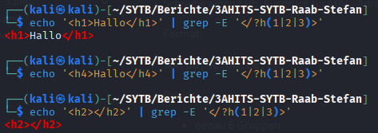
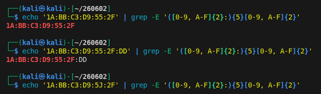

# Arbeitsbericht

- Name: Stefan Raab
- Datum: 26.05.2026
- Thema: Regular expressions II
- Fach: SYTB
- Klasse: 3AHITS

---

## Aufgaben

### Übung (Postleitzahlen prüfen)

Schreibe einen ERE-Ausdruck für österreichische Postleitzahlen.

Regeln:

   - genau 4 Ziffern
   - erste Ziffer darf nicht 0 sein

Gültig:

```
4020
5280
1010
```

Ungültig:
```
0123
123
12345
abcd
```

---

ERE-Ausdruck: `^[1-9][0-9]{3}$`

- `^[1-9]`: Zahl zwischen 1 und 9 am Anfang (Keine 0!)
- `[0-9]{3}$`: 3 weitere Zahlen zwischen 0 und 9, dann Ende der Zeile

Testen:
```bash
┌──(kali㉿kali)-[~/SYTB/Berichte/3AHITS-SYTB-Raab-Stefan]
└─$ echo 1234 | grep -E ^[1-9][0-9]{3}$
1234
                                                                             
┌──(kali㉿kali)-[~/SYTB/Berichte/3AHITS-SYTB-Raab-Stefan]
└─$ echo 12344 | grep -E ^[1-9][0-9]{3}$
                                                                             
┌──(kali㉿kali)-[~/SYTB/Berichte/3AHITS-SYTB-Raab-Stefan]
└─$ echo 0234 | grep -E ^[1-9][0-9]{3}$
                                                                             
┌──(kali㉿kali)-[~/SYTB/Berichte/3AHITS-SYTB-Raab-Stefan]
└─$ echo 234 | grep -E ^[1-9][0-9]{3}$ 
                                                                             
┌──(kali㉿kali)-[~/SYTB/Berichte/3AHITS-SYTB-Raab-Stefan]
└─$ echo 2561 | grep -E ^[1-9][0-9]{3}$
2561
```

---

### Übung (HTML-Überschriften finden)

Finde alle HTML-Überschriften der Form:

```html
<h1>Text</h1>
<h2>Hallo</h2>
<h3>Regex</h3>
```

Regeln:

   - nur h1, h2 oder h3
   - öffnender und schließender Tag müssen zusammenpassen

---

Ausdruck: `'</?h(1|2|3)>'`

- `/?`: `/` kann vorkommen, muss aber nicht
- `h(1|2|3)`: Es wird nach einem `h` gefolgt von `1`, `2` oder `3` gesucht

Test(Screenshot):



---

### Übung (MAC-Adressen validieren)

Schreibe einen ERE-Ausdruck für MAC-Adressen.

Format:

`AA:BB:CC:DD:EE:FF`

Regeln:

   - genau 6 Gruppen
   - jeweils 2 hexadezimale Zeichen
   - Trennung durch `:`

---

Ausdruck: `'([0-9, A-F]{2}:){5}[0-9, A-F]{2}'`

- `([0-9, A-F]{2}:){5}`: Zwei Hexadezimale Zeichen (0-9 und A-F), gefolgt von einem `:`. Das Ganze 5-mal.
- `[0-9, A-F]{2}`: Nochmal zwei Hexadezimale Zeichen.

Testen (Screenshot):



---

### Übung (MAC-Adressen validieren – Skript)

Erstelle ein shell script das eine Mac Adresse als Argument übergeben bekommt und diese mit Hilfe eines ERE-Ausdrucks validiert. Es soll eine passende Ausgabe erzeugt und der exit Status gesetzt werden, so dass man dieses Script aus einem anderen Script heraus aufrufen kann.

---

Skript:
```sh
#!/bin/env bash

MAC="$1"

if echo "$MAC" | grep -Eq '^([0-9, A-F]{2}:){5}[0-9, A-F]{2}$'
then
    echo "Gueltige MAC!"
    exit 0
else
    echo "Ungueltige MAC!"
    exit 1
fi
```

- Die Option `-q` bei `grep` liefert selbst einen exit Code wenn ein passendes Muster gefunden wurde.

Testen:
```bash
┌──(kali㉿kali)-[~/260609]
└─$ ./MAC.sh 11:22:33:44:55:66
Gueltige MAC!
                                                                                                                                                                  
┌──(kali㉿kali)-[~/260609]
└─$ ./MAC.sh 11:22:33:44:55:66:77
Ungueltige MAC!
                                                                                                                                                                  
┌──(kali㉿kali)-[~/260609]
└─$ ./MAC.sh 11:22:33:44:55:ZZ   
Ungueltige MAC!
                                                                                                                                                                                                                                                                                             
┌──(kali㉿kali)-[~/260609]
└─$ ./MAC.sh 11:22:C3:F4:55:66
Gueltige MAC!
```

---

### Übung (URLs prüfen)

Schreibe einen ERE-Ausdruck für einfache URLs.

Gültig:

```text
https://example.com
http://test.at
https://sub.domain.org
```

Ungültig:

```text
ftp://example.com
https:/example.com
example.com
```

Regeln:

- nur `http` oder `https`
- Domain darf Buchstaben, Zahlen und Punkte enthalten

---

Ausdruck: `'^(http|https)://[a-F, 0-9, \.]+.(com|at|de)'`

- `^(http|https)`: entweder `http` oder `https` am Anfang der Zeile
- `://`: fester Bestandteil der URL
- `[a-F, 0-9, \.]+`: beliebige Buchstaben oder Zahlen als auch Punkte
- `.(com|de|at)`: Endung. In meinem Beispiel werden nur URLs mit `.com`, `.de` oder `.at` gematcht. Diese Auswahl könnte man natürlich erweitern.

Testen:
```bash
┌──(kali㉿kali)-[~/260609]
└─$ echo 'http://testurl.com' | grep -E '^(http|https)://[a-F, 0-9, \.]+.(com|at|de)' 
http://testurl.com
                                                                                                                                                                            
┌──(kali㉿kali)-[~/260609]
└─$ echo 'http://test.url.com' | grep -E '^(http|https)://[a-F, 0-9, \.]+.(com|at|de)'
http://test.url.com
                                                                                                                                                                            
┌──(kali㉿kali)-[~/260609]
└─$ echo 'https://test.url.com' | grep -E '^(http|https)://[a-F, 0-9, \.]+.(com|at|de)'
https://test.url.com
                                                                                                                                                                            
┌──(kali㉿kali)-[~/260609]
└─$ echo 'https://#wrong_test.url.com' | grep -E '^(http|https)://[a-F, 0-9, \.]+.(com|at|de)'
```

---

### Übung (Verdoppelte Wörter finden)

Finde doppelte Wörter direkt hintereinander.

Beispiele:

```
das das
Test Test
hallo hallo
```

Ungültig:

```
das ist
Hallo hallo
```

Hinweis:

   - verwende Backreferences

---

**Nicht mehr gemacht!**