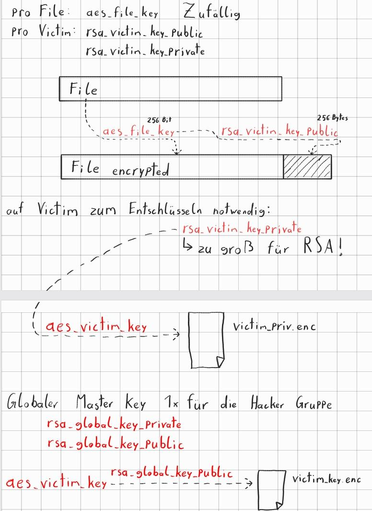
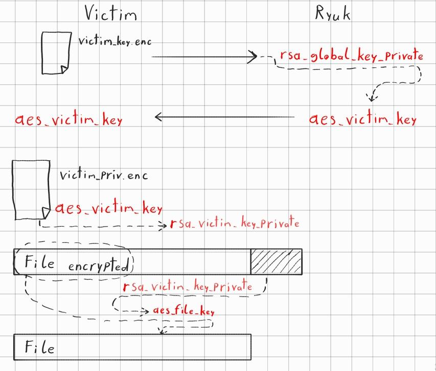

# Bericht
- Name: Stefan Raab
- Klasse: 4AHITS
- Fach: ITSE
- Datum: 05.10.2026
- Angabe: https://www.franzmatejka.at/htl/doc/ITSI/lab/ransom_ryuk/01_ryuk.html

## Theorie

Warum AES-256-CBC für das verschlüsseln der einzelnen Dateien

- Deutlich schnellere Verschlüsselung als RSA

Warum ein eigener Key für jede Datei

- Damit man nicht durch brute-force auf den Key kommt der alles entschlüsselt

Warum wird dieser AES key dann RSA verschlüsselt

- Damit das Opfer seine Files nicht einfach wieder entschlüsseln kann.

warum an die Datei angehängt

- Damit das Opfer nach der Zahlung und mithilfe des RSA-Schlüssels seine Files wieder entschlüsseln kann.

warum wird der victim rsa private key dann AES verschlüsselt

- Um ihn in einem File auf dem Opfer-System ablegen zu können

warum wird ein globale RSA key verwendet um aes_victim_key zu verschlüsseln

## Aufgabe 1.1

